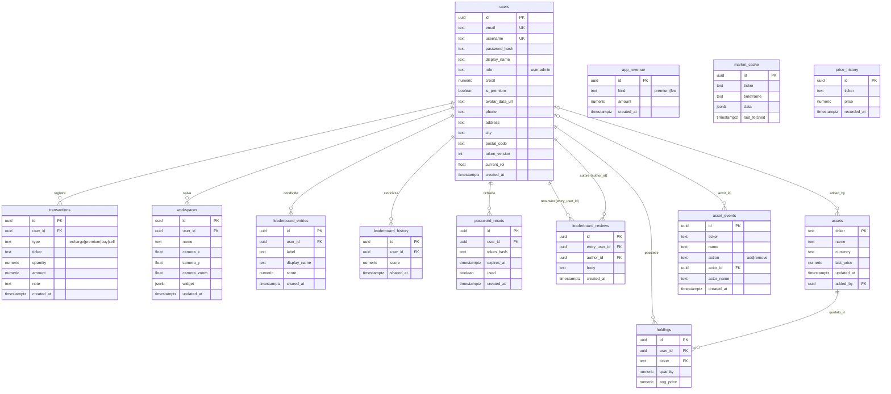

# Divide_et_Quantifica
Divide et Quantifica (DeQ) è un ecosistema full-stack per l'analisi finanziaria visiva e la simulazione di trading. Sfrutta una Infinite Canvas a nodi vettoriali per esplorare dati di mercato in tempo reale, combinata con un terminale broker completo.

    
Legenda relazioni (chiavi esterne)

users → holdings / transactions / workspaces / leaderboard_entries / leaderboard_history / password_resets: ON DELETE CASCADE (eliminando l'utente si eliminano i suoi dati).

users → leaderboard_reviews: due FK — entry_user_id (utente recensito) e author_id (utente autore), entrambe CASCADE.

users → assets (added_by) / asset_events (actor_id): ON DELETE SET NULL (lo storico resta anche se l'admin viene eliminato).

assets → holdings (ticker): CASCADE.

Vincoli di unicità: users.email, users.username; holdings (user_id, ticker); market_cache (ticker, timeframe); leaderboard_entries (user_id, label) → è ciò che consente più schede per profilo.

Note (relazioni "logiche" senza FK)

Alcune tabelle referenziano un asset per stringa ticker senza vincolo FK (così restano valide anche per ticker non più nel listino):

market_cache, price_history, asset_events, e il campo transactions.ticker → puntano logicamente ad assets.ticker.

app_revenue è indipendente (nessuna FK): persiste anche dopo l'eliminazione di utenti/asset.

Tabelle standalone / append-only: app_revenue, price_history, leaderboard_history, asset_events, market_cache.
